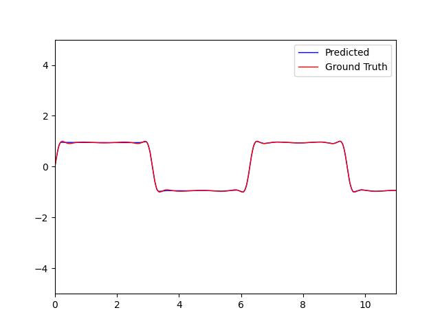

## 11310CS460200 Intro 2 ML Lab 4
|Name|Date|
|:-:|:-:|
|110020007 施淙綸|2024/11/14|

### What are the key differences between sigmoid and softmax activation functions, and why did we choose them for binary and multi-class classification respectively?
- Both of them using for classification tasks, sigmoid outputs a probability between 0 and 1, while softmax outputs the distribution across multi-classes which sum up to 1.
- We can use sigmoid for binary-classes because it's output is probability of each class, which can categorize into different class. Similarly, we can selecting the class has largest value of the output of softmax as the predict class.

### Why does the loss oscillate during model training? (list at least 2 reasons)
1. **Learning Rate**: If the learning rate set too high, the update scale of parameter will too large, leading to unstable training process (i.e. the loss oscillate).
2. **Batch Distribution**: When using stochastic gradient descent (SGD) or mini-batch gradient descent, the distribution of one batch can be very different, leading to unstable update process (i.e. the loss oscillate).

### How does changing the learning rate and batch size affect model training time?
- **Learning Rate**: If the learning rate is set to a large number, the training process will be unstable, and the model may not converge in some cases. When the learning rate is set to a small number, the update scale in each step is too small, leading to a slow training process.
- **Batch Size**: If the batch size is set to a large number, the update time of each step will be longer because more calculations are needed. When the batch size is set to a small number, the update time of each step will be shorter, but more iterations are needed in the training process. In general, a smaller batch size has more noise and costs more time in training than a larger one.

